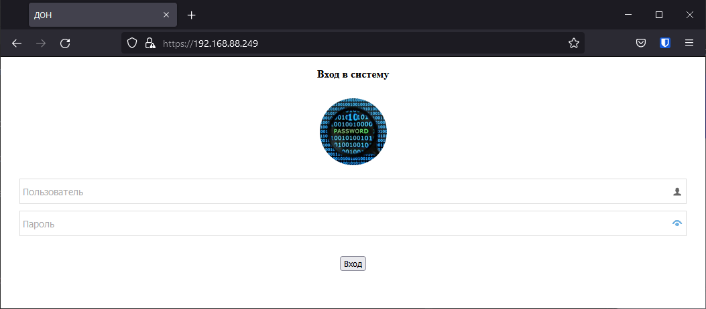
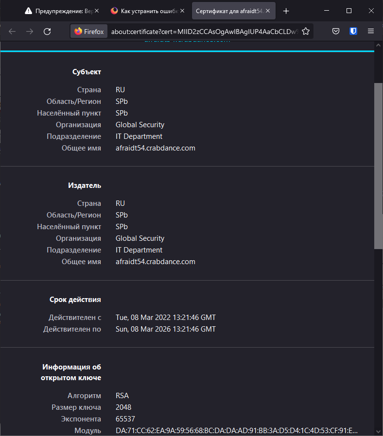
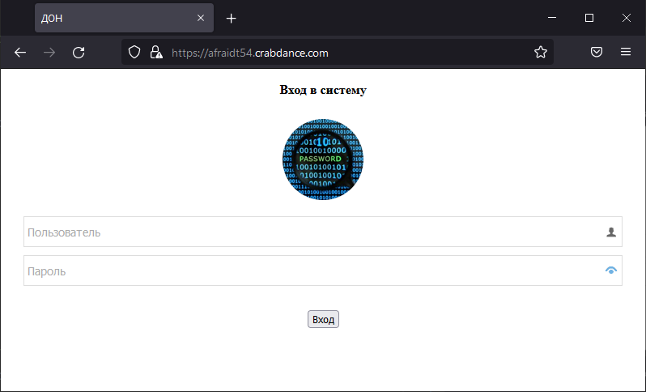
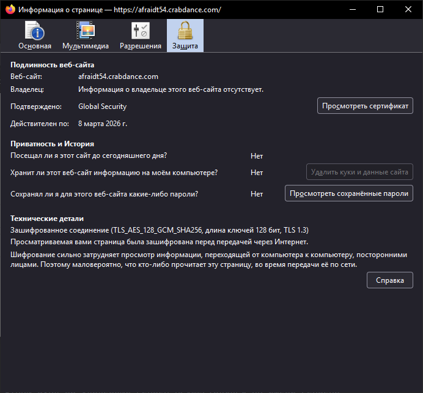
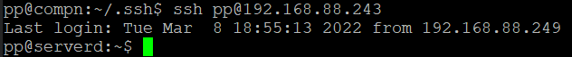
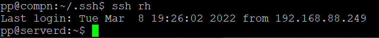
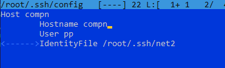

# Исправление Домашнее задание к занятию "3.9. Элементы безопасности информационных систем"


3. Установите apache2, сгенерируйте самоподписанный сертификат, настройте тестовый сайт для работы по HTTPS.

Замечания: Обратите внимание на то, что в поле CN (Canonical Name) сертификата должно быть то же самое доменное имя, которое вы будете водить в браузере. Для того, чтобы подключиться к локальному серверу по доменному имени, внесите соответствующую запись в файл /etc/hosts. Также следует при настройке apache указать то же самое доменное имя в директиве ServerName. Когда после этого вы подключитесь к локальному серверу, вы всё равно увидите предупреждение о недействительности сертификата, ведь вы подписали его сами, вашего “удостоверяющего центра” нет среди доверенных Certificate Authority в браузере. Тем не менее для целей данной работы такой конфигурации достаточно.

Было ранее -
>openssl req -new -x509 -days 1461 -nodes -out cert.pem -keyout cert.key -subj "/C=RU/ST=SPb/L=SPb/O=Global Security/OU=IT Department/CN=afraidt54.crabdance.com"  
>
>

Исправление: -
Согласен первый рисунок не показателен, сайт был создан и через NAT маршрутизатора с использованием DDNS позволял подключаться под указаным ранее именем через интернет.
Привожу исправленную картинку подключение по имени сайта, картинка делалась не с самого сервера, а c хоста находящегося в одной с ним сети для маршрутизации на него исправлен файл хост, возможен вариант исправления маршрута для этого сайта на маршрутизаторе для все компов локальной сети. 




5. Установите на Ubuntu ssh сервер, сгенерируйте новый приватный ключ. Скопируйте свой публичный ключ на другой сервер. Подключитесь к серверу по SSH-ключу.    
>ssh-keygen  
>ssh-copy-id pp@192.168.88.243  
> ssh pp@192.168.88.243  
> 

6. Переименуйте файлы ключей из задания 5. Настройте файл конфигурации SSH клиента, так чтобы вход на удаленный сервер осуществлялся по имени сервера.  
####Замечания:- В задании указано: “переименуйте файлы ключей из задания 5”. Пример конфигурационного файла, который вы приводите, не позволит работать с переименованным ключом.

Файлы на сервере "Переименованы" оставлены старые имена, для подключения по имени сервера достаточно изменить псевдоним в файле конфигурации ssh пример приведен, подключение будет по любому псевдониму указному в нем в первой строке, пример в скриншоте подключение по "имени" хоста!

>mkdir -p ~/.ssh && chmod 700 ~/.ssh  
>touch ~/.ssh/config && chmod 600 ~/.ssh/config  
>Минимальная конфигурация файла config  
```bash
Host rh  
        Hostname 192.168.88.243
        User pp
```
>Пример выполнения


Не вполне ясно задание(
возможно требуется следующее создаем ключи переименовываем(не несет никакой нагрузки это действие, запуск будет по указаным в конфигурации ключам), настраиваем конфигурацию на них.

```commandline
root@vagrant:~/.ssh# ssh-keygen
Generating public/private rsa key pair.
Enter file in which to save the key (/root/.ssh/id_rsa): net
Enter passphrase (empty for no passphrase):
Enter same passphrase again:
Your identification has been saved in net
Your public key has been saved in net.pub
The key fingerprint is:
SHA256:uwjkUhoeaKmiLGd5VmlklRPosRmSiWQ7JeG1r0Y9x4M root@vagrant
The key's randomart image is:
+---[RSA 3072]----+
| .=ooo ..o       |
| o.=+.+ +        |
|  + .o * .       |
| ... o*o         |
|.oo +oE.S        |
|o. O .+o o       |
|o +.=o  .        |
|= +oo. . .       |
|o+ o  . .        |
+----[SHA256]-----+

root@vagrant:~/.ssh# ssh-copy-id -i ~/.ssh/net pp@192.168.88.249
/usr/bin/ssh-copy-id: INFO: Source of key(s) to be installed: "/root/.ssh/net.pub"
/usr/bin/ssh-copy-id: INFO: attempting to log in with the new key(s), to filter out any that are already installed
/usr/bin/ssh-copy-id: INFO: 1 key(s) remain to be installed -- if you are prompted now it is to install the new keys
pp@192.168.88.249's password:

Number of key(s) added: 1

Now try logging into the machine, with:   "ssh 'pp@192.168.88.249'"
and check to make sure that only the key(s) you wanted were added.

root@vagrant:~/.ssh# ssh -i ~/.ssh/net pp@192.168.88.249
Last login: Sun Mar 20 10:57:02 2022 from 192.168.88.254
pp@compn:~$ hostname
compn

mv ~/.ssh/net ~/.ssh/net2
mv ~/.ssh/net.pub ~/.ssh/net2.pub
добавляем в файл host ифнормацию по серверу для доступа по имени.

root@vagrant:~/.ssh# ssh -i ~/.ssh/net2 pp@compn
Last login: Sun Mar 20 11:05:06 2022 from 192.168.88.254
pp@compn:~$ hostname
compn


добавляем файл конфигурации
```



```commandline


root@vagrant:~/.ssh# ssh compn
Last login: Sun Mar 20 11:14:57 2022 from 192.168.88.254
pp@compn:~$ hostname
compn


```

