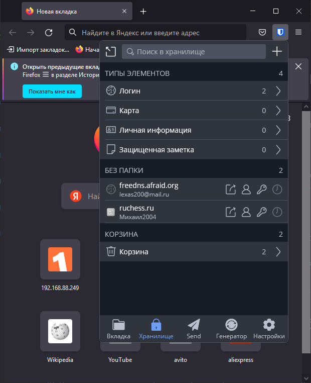
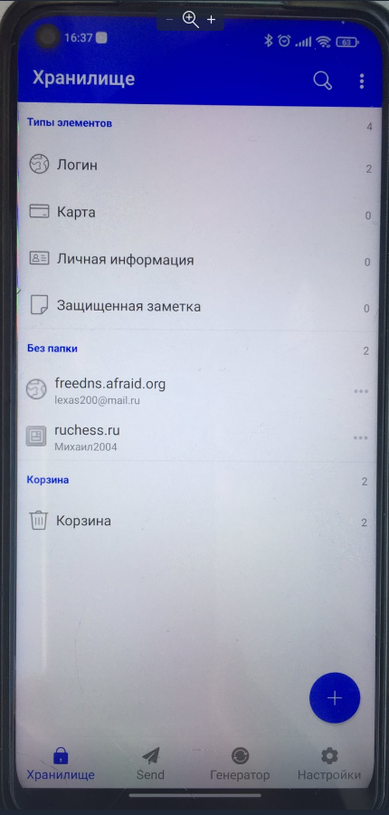
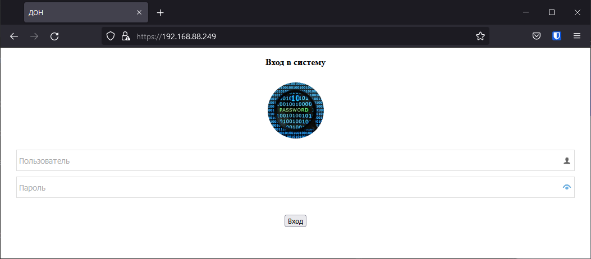
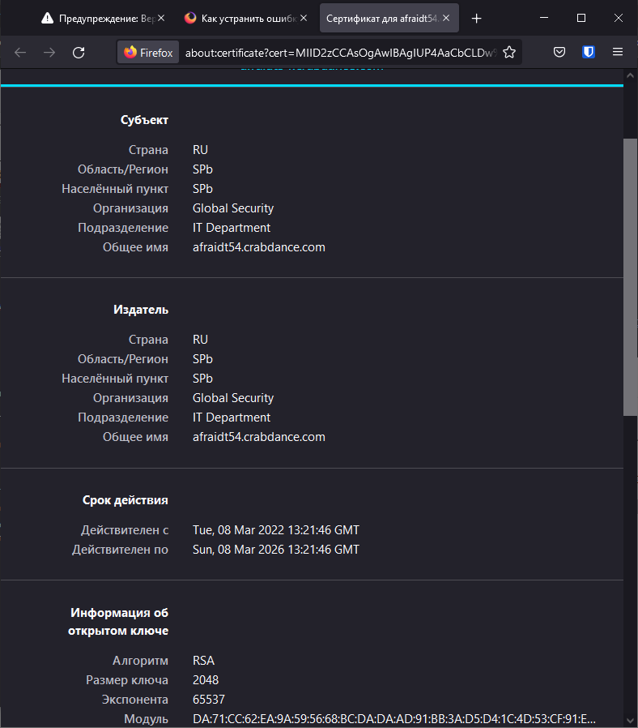
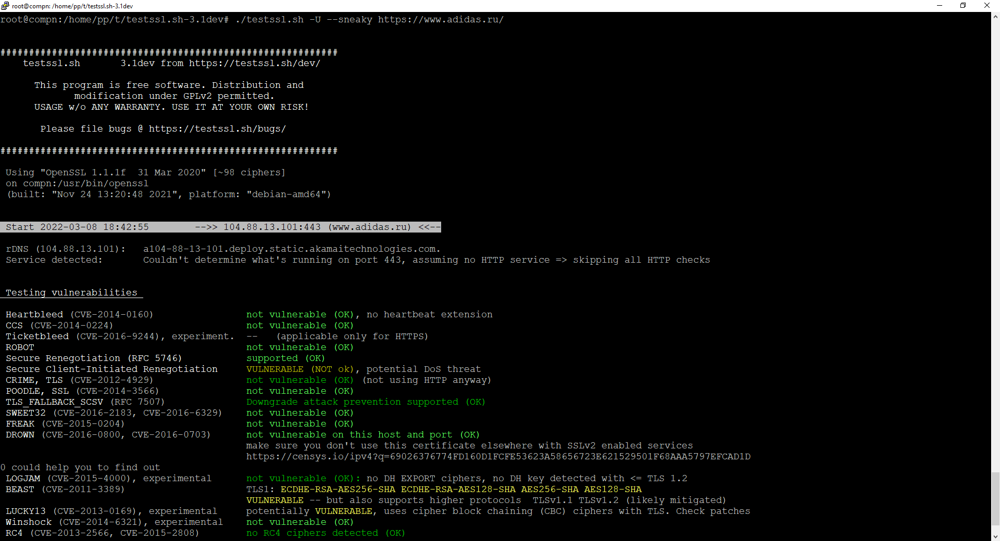
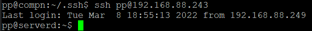
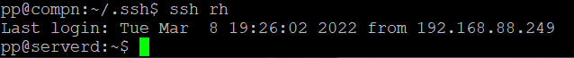
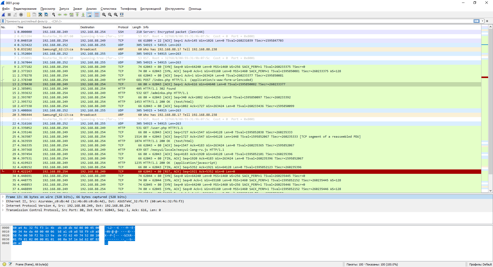

# Домашнее задание к занятию "3.9. Элементы безопасности информационных систем"

1. Установите Bitwarden плагин для браузера. Зарегестрируйтесь и сохраните несколько паролей.  
>

2. Установите Google authenticator на мобильный телефон. Настройте вход в Bitwarden акаунт через Google authenticator OTP.  
>
3. Установите apache2, сгенерируйте самоподписанный сертификат, настройте тестовый сайт для работы по HTTPS.  
>openssl req -new -x509 -days 1461 -nodes -out cert.pem -keyout cert.key -subj "/C=RU/ST=SPb/L=SPb/O=Global Security/OU=IT Department/CN=afraidt54.crabdance.com"  
>
>

4. Проверьте на TLS уязвимости произвольный сайт в интернете (кроме сайтов МВД, ФСБ, МинОбр, НацБанк, РосКосмос, РосАтом, РосНАНО и любых госкомпаний, объектов КИИ, ВПК ... и тому подобное).
>
>Уязвимость DoS, низкие верисии TLS,старые версии ПО.
5. Установите на Ubuntu ssh сервер, сгенерируйте новый приватный ключ. Скопируйте свой публичный ключ на другой сервер. Подключитесь к серверу по SSH-ключу.    
>ssh-keygen  
>ssh-copy-id pp@192.168.88.243  
> ssh pp@192.168.88.243  
> 

6. Переименуйте файлы ключей из задания 5. Настройте файл конфигурации SSH клиента, так чтобы вход на удаленный сервер осуществлялся по имени сервера.  
>mkdir -p ~/.ssh && chmod 700 ~/.ssh  
>touch ~/.ssh/config && chmod 600 ~/.ssh/config  
>Минимальная конфигурация файла config  
```bash
Host rh  
        Hostname 192.168.88.243
        User pp
```
>Пример выполнения



7. Соберите дамп трафика утилитой tcpdump в формате pcap, 100 пакетов. Откройте файл pcap в Wireshark.  
>tcpdump -c 100 -w 0001.pcap -i wlp2s0  
> 
